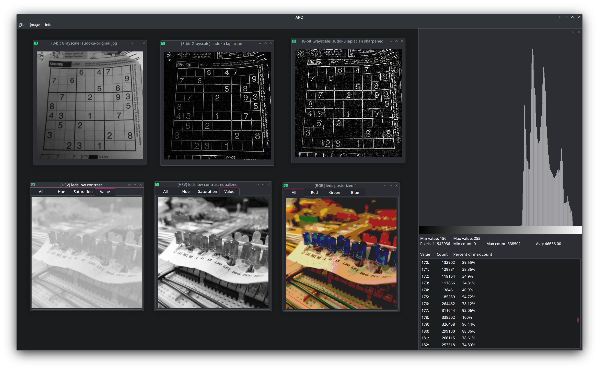

# APO
Program for processing images, functionally similar to [ImageJ](https://imagej.net/software/imagej2/) but with a 
Multiple Document Interface to have all images contained in just one window.

